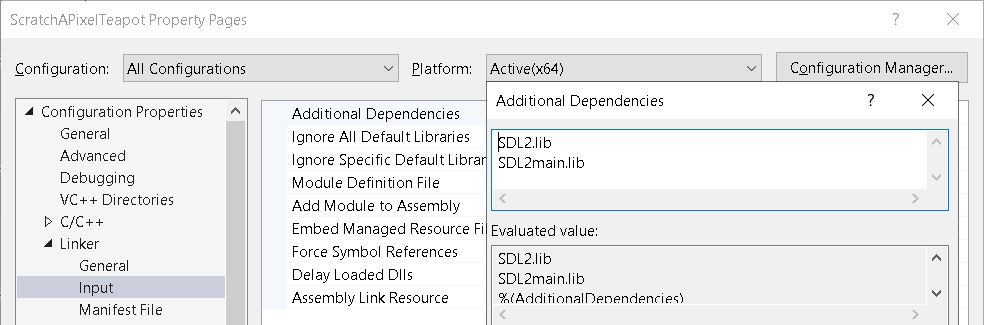

## Base files
qbImage.cpp and qbImage.h are from https://github.com/QuantitativeBytes/qbRayTrace/tree/main/Ep10Code/qbRayTrace
raytracetransform.cpp, geometry.h and teapot.geo are from https://www.scratchapixel.com/code.php?id=12&origin=/lessons/3d-basic-rendering/transforming-objects-using-matrices&src=1 

## Library
### SDL2 library 
- Download SDL2 from https://libsdl.org/release/SDL2-devel-2.0.22-VC.zip
- Extract the zip and provide the relevant paths of SDL2 in Visual Studio project
   - 
   - 
   - 
- Add the SDL library path "C:\Project\Softwares\SDL2\SDL2-2.0.22\lib\x64" to environmental variable "Path"

